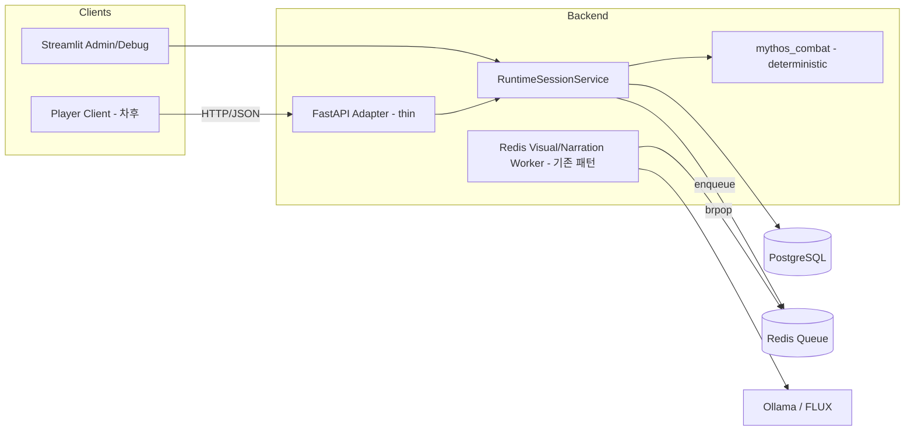

# Engine Decoupling — 현실화 제안 (2026-05-31)

> 루트 `report.md`(FastAPI+Celery+React/Unity+멀티플레이어 제안)를 **사실 정정하고 스코프를
> 현실화**한 버전. MythOS는 CLAUDE.md 기준 **로컬 1인용** 내러티브 시뮬레이션이며, 이 문서는
> "지금 할 일 / 보류할 일 / 빼는 일"을 코드 근거와 함께 구분한다.

---

## 1. 현황 정정 (Reality Check)

### 1.1 전투 보드가 "안 보인" 진짜 원인
- 증상은 렉/깜빡임이 아니라 **보드가 DOM에 아예 없었다**.
- 원인: `_render_tactical_board_interactive`가 전술 보드를 `st.markdown(..., unsafe_allow_html=True)`로
  출력했고, **Streamlit 1.58의 markdown sanitizer가 `<iframe>` 태그를 제거**했다. (전투 종료 SFX의
  `st.markdown` iframe `srcdoc`도 같은 이유로 무재생.)
- 해법(적용 완료): 보드 HTML(CSS+JS)을 `streamlit_app.py`에 인라인 상수로 내장하고, 데이터/SFX(소형
  base64 data URI)를 직접 주입해 **`st.iframe`(권장 API)로 same-origin srcdoc 렌더**. srcdoc이 메인
  문서와 same-origin이라 기존 `window.parent.document` 액션 주입(드래그앤드롭/클릭 이동)이 그대로 동작.
  외부 static HTTP 서버(`_start_combat_static_server`)와 URL 해시 통신은 제거됨.

> 따라서 `report.md`의 2장 "현재 상태"와 로드맵 Phase 1(정적 서버 + 해시 통신 완료)은 **이미 무의미**하다.

### 1.2 진단 정정
| report.md 주장 | 사실 |
| :--- | :--- |
| 대용량 base64 오디오 srcdoc 주입 → 화이트 스크린 크래시 | SFX 원샷은 47~137KB(=base64 ~180KB)로 "대용량" 아님. 보드 미표시와 무관. |
| AI 턴 연산 렉 (전투) | `mythos_combat`는 **결정적**(dice/initiative). `narrator.py`는 "LLM 없이도" 도는 fallback prose이고 LLM 내레이터는 미래 Phase. 전투 턴은 LLM-bound 아님. |
| Rerun이 전투의 주된 병목 | 전투 UI는 이미 `@st.fragment`로 격리됨. 남은 비용은 주로 **액션당 DB 연결 churn**. |

### 1.3 남아있는 실제 결합 통증
- 액션마다 `PostgresMythOSStore()`를 새로 열고 닫음(`_run_combat_action`, `_load_current_snapshot`,
  `_load_memory_overview`) → 연결 churn.
- LLM **서사 장면** 생성 지연(수 초) — 단, 이미 `stream_choose`로 토큰 스트리밍 완화 중.
- 이미지 생성 — 이미 Redis 비동기 워커로 처리됨(Phase 13).

---

## 2. 지금 할 일 (Streamlit 유지, 저비용·고효과)

Streamlit을 유지하면서 결합 통증을 줄이는 실행 가능한 작업. 큰 재아키텍처 없이 ROI가 높다.

| 작업 | 대상 | 기대 효과 |
| :--- | :--- | :--- |
| **DB 연결 churn 정리** | `_run_combat_action` / `_load_current_snapshot` / `_load_memory_overview` (`streamlit_app.py`), `PostgresMythOSStore` | 액션당 store open/close 제거. Streamlit 세션 수명 동안 store 재사용 또는 경량 커넥션 풀 → 액션 지연·flicker 감소. |
| **비동기는 기존 패턴 재사용 원칙 고정** | `src/mythos_runtime/visual_queue.py` 패턴 | 향후 전투 LLM 내레이터가 들어오면 `VisualJobQueue`(lpush/brpop + heartbeat 락)를 본떠 narration job 큐로 처리. **신규 Celery 금지**(중복). |
| **프래그먼트 범위 점검** | `_render_combat_arena_fragment` 등 | 전투 외 스트리밍 영역도 필요 시 `@st.fragment` 격리 유지해 전체 rerun 차단. |

> 권장 착수 순서: **DB churn 정리** 1건만 먼저 적용해 체감 개선을 확인한 뒤, 나머지는 필요 시.

---

## 3. 분리(FastAPI) 트랙 — 보류 + 트리거 조건

분리 자체는 타당한 north star지만 **지금 착수 대상은 아니다**. 아래 조건 중 하나가 충족되면 착수한다.

**트리거 조건**
- (a) 비-Streamlit 웹/게임 클라이언트가 실제로 필요해질 때.
- (b) 멀티플레이어/관전 요구가 생길 때.
- (c) Streamlit rerun이 **측정으로 확인된** 차단 병목이 될 때(2장 정리 후에도).

**착수 시 형태 (재작성이 아니라 래핑)**
- `RuntimeSessionService`(이미 facade)를 그대로 감싸는 **얇은 FastAPI 어댑터** → `src/mythos_runtime/api`.
- 비동기는 **기존 Redis 워커 패턴 확장**(별도 브로커 신설 금지).
- Streamlit은 폐기가 아니라 **관리자/디버그 도구**로 전환.

---

## 4. 현 단계에서 빼는 것 (비채택)

- **Celery** — `VisualJobQueue`와 중복. 기존 Redis 패턴으로 충분.
- **Unity/WebGL, Discord 클라이언트** — 스코프 밖.
- **멀티플레이어/관전** — 1인용 설계와 상충, 먼 미래 옵션.
- **"60+ FPS 보장" 류 약속** — 병목은 렌더가 아니라 LLM. 과약속.

---

## 5. 연계 / 후속

- `docs/DECISIONS.md`에 1건 기록 권고: *"FastAPI 분리는 §3 트리거 조건 충족 전까지 보류, 비동기는
  Redis 워커 패턴 재사용(Celery 비채택)."*
- `docs/NEXT_PLAN.md`의 "클라우드 확장 설계(선택)" 항목이 이 문서를 가리키도록 교차 링크.
- 우선순위상 이 트랙보다 **전투 스킬/아이템 엔진 배선·동료 참전**(NEXT_PLAN 후속)이 앞선다.
