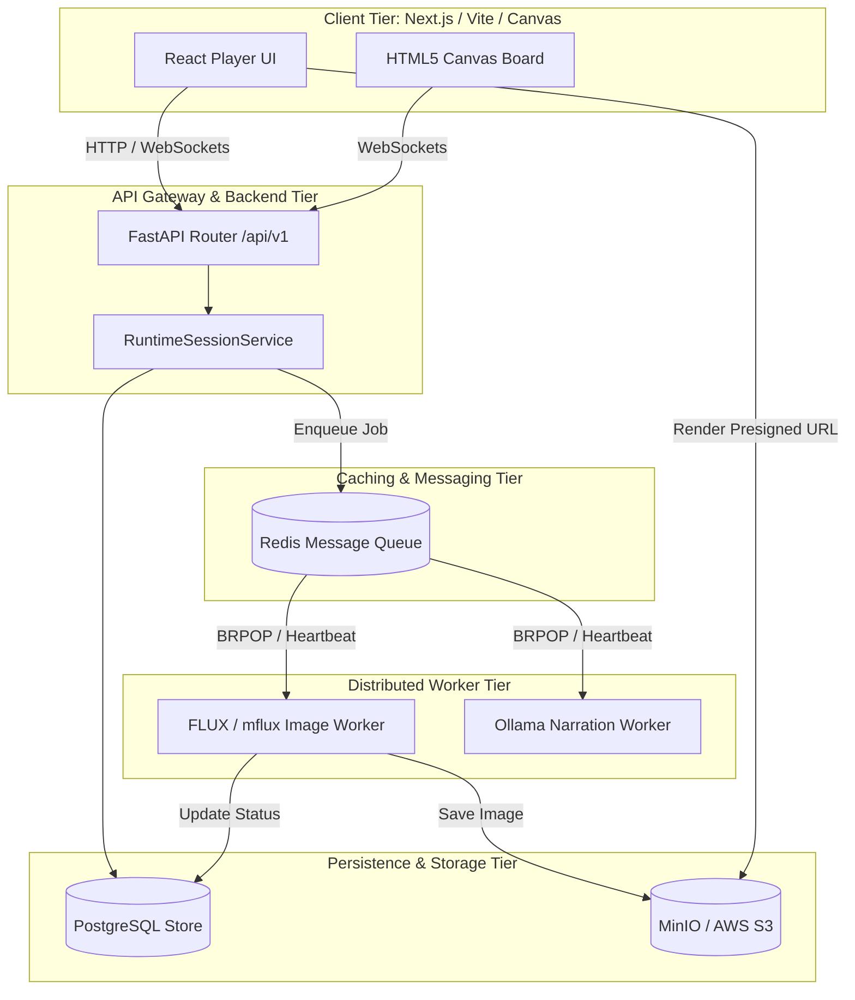

# Web UI & Distributed Worker Decoupling Architecture Design

작성일: 2026-06-03
상태: Approved (P3 Spec)

이 문서는 Project MythOS의 기존 Monolithic Streamlit 구조를 탈피하고, **FastAPI 백엔드 어댑터와 Next.js/Vite 프론트엔드로의 분리(Decoupling)** 및 **원격 비주얼 워커/S3 클라우드 확장**을 구현하기 위한 최종 아키텍처 사양을 정의한다.

---

## 1. 아키텍처 개요 (System Architecture)

전체 시스템은 API 중심의 분산 아키텍처로 전환되며, 동기식 TRPG 흐름 처리(FastAPI + RuntimeSessionService)와 비동기식 고부하 무거운 AI 생성 태스크(Ollama, FLUX, Audio)를 Redis Queue 기반의 독립 워커로 격리한다.



---

## 2. API boundaries (REST & WebSockets)

백엔드와 프론트엔드는 명확한 상태 전이 계약을 따른다.

### 2.1 REST Endpoints
모든 REST API는 `/api/v1` 프리픽스를 사용하며, `RuntimeSnapshot`에 기반한 일관된 JSON 형태를 반환한다.

| Method | Endpoint | Description | Request Body | Response Body (JSON) |
| :--- | :--- | :--- | :--- | :--- |
| **POST** | `/api/v1/auth/connect` | 플레이어 접속 및 인증 | `{"display_name": "string"}` | `PlayerProfile` (ID, traits, stats) |
| **POST** | `/api/v1/loops/begin` | 새로운 루프 시작 | `{"archetype": "string", "seed": "string"}` | `RuntimeSnapshot` |
| **GET** | `/api/v1/loops/active` | 현재 진행 중인 루프 로드 | None | `RuntimeSnapshot` |
| **POST** | `/api/v1/loops/choose` | 시나리오 일반 분기 선택 | `{"choice_id": "string"}` | `RuntimeSnapshot` (Narrative Shard) |
| **POST** | `/api/v1/combat/begin` | 전투 인카운터 생성 | `{"encounter_id": "string"}` | `CombatState` |
| **POST** | `/api/v1/combat/action` | 전투 턴 액션 (이동, 스킬, 아이템) | `{"combatant_id": "str", "action_type": "move/skill/item", "target_pos": [x,y]}` | `CombatState` (전투 보드 최신화) |

### 2.2 WebSocket Endpoint: 토큰 스트리밍 및 실시간 이벤트
Ollama 기반 서사 생성의 대기 시간을 최소화하기 위해 스트리밍 인터페이스를 웹소켓으로 단일화한다.

*   **Endpoint**: `/api/v1/loops/stream`
*   **프로토콜 흐름**:
    1.  클라이언트가 웹소켓 연결 수립.
    2.  클라이언트가 분기 선택 신호 전송: `{"event": "choose", "choice_id": "choice_1_approach"}`
    3.  백엔드가 LLM GM의 텍스트 토큰을 실시간 스트리밍:
        - `{"type": "token", "content": "어"}`, `{"type": "token", "content": "두운"}`...
    4.  스트리밍 종료 시 백엔드가 최종 루프 스냅샷 송신: `{"type": "snapshot", "data": {...}}`
    5.  비주얼 생성 큐 등록 시 이미지 진행 상태 전송:
        - `{"type": "visual_status", "status": "pending", "asset_id": "..."}`
        - `{"type": "visual_status", "status": "processing"}`
        - `{"type": "visual_status", "status": "succeeded", "url": "presigned_s3_url"}`

---

## 3. Frontend State & Component Mapping

프론트엔드는 백엔드에서 반환된 `RuntimeSnapshot`과 `CombatState`를 기반으로 로컬 상태(Store)를 관리한다.

### 3.1 State Mapping Schema
Next.js/React App에서는 **Zustand** 또는 **Redux Toolkit**을 사용해 글로벌 게임 상태를 정의한다.

```typescript
interface GameState {
  player: PlayerProfile | null;
  loopId: string | null;
  phase: "connect" | "explore" | "interact" | "rewrite" | "archive";
  location: string;
  autonomy: number; // 1-5
  metrics: {
    humanity: number;
    dominance: number;
    resilience: number;
    insight: number;
  };
  activeScene: {
    title: string;
    narration: string;
    choices: Choice[];
    visualBrief: string;
    imageUrl: string | null;
    isGeneratingImage: boolean;
  };
  combat: CombatState | null;
}
```

### 3.2 낙관적 UI 업데이트 및 스트리밍 처리
- 사용자가 선택지를 클릭하면, 즉시 로컬 상태의 `choices`를 비활성화하고 로딩 인디케이터를 활성화한다.
- 웹소켓으로 수신되는 텍스트 토큰(`"type": "token"`)을 `activeScene.narration`에 점진적으로 추가하여 렌더링한다.
- 이미지 생성 완료 소켓 신호(`"type": "visual_status"`)가 오면 `isGeneratingImage`를 `false`로 바꾸고 `imageUrl`을 바인딩한다.

---

## 4. Canvas 기반 인터랙티브 전술 보드 (Combat Canvas)

기존 Streamlit iframe 방식의 마운트 및 렌더 렉을 근본적으로 극복하기 위해, 프론트엔드 자체 **HTML5 Canvas** 또는 **SVG** 컴포넌트를 설계한다.

### 4.1 렌더링 아키텍처
전술 전투 격자판(예: 8x6 Grid)은 PixiJS 또는 React-Konva와 같은 경량 2D Canvas 라이브러리를 통해 그린다.

```javascript
// Canvas Double-Buffering & Grid Renderer
class CombatGrid {
  constructor(canvas, cols, rows) {
    this.canvas = canvas;
    this.ctx = canvas.getContext('2d');
    this.cols = cols;
    this.rows = rows;
    this.cellWidth = canvas.width / cols;
    this.cellHeight = canvas.height / rows;
  }

  draw(combatState) {
    this.ctx.clearRect(0, 0, this.canvas.width, this.canvas.height);
    this.drawGridLines();
    this.drawObstacles(combatState.obstacles);
    this.drawCombatants(combatState.combatants);
    if (this.selectedUnit) {
      this.drawRangeRing(this.selectedUnit);
    }
  }
}
```

### 4.2 Interaction 설계 (Drag & Drop 및 Pathfinding Overlay)
- **Hover & Range Display**: 사용자가 아군 캐릭터에 마우스를 올리거나 터치하면 이동력(`speed`) 범위에 해당되는 격자칸을 반투명 사이언 블루(Y2K 테마)로 표시한다.
- **Click-to-Move / Drag-to-Target**:
  1.  격자 위의 캐릭터 클릭 시 **Selected** 상태로 전이.
  2.  이동 가능한 빈 격자 클릭 시 REST API `/api/v1/combat/action` (`action_type: "move"`) 호출 및 낙관적 위치 이동.
  3.  스킬 드래그앤드롭: 하단 스킬 바의 스킬 아이콘을 드래그하여 적 위에 놓을 때 스킬 트리거.
- **애니메이션 처리**: 좌표 이동 시 프론트엔드가 단순 순간이동이 아닌 선형 보간(Lerp) 애니메이션을 지원하여 자연스러운 전투 연출 제공.

---

## 5. 분산 비주얼 워커 및 S3 스토리지 파이프라인

로컬 서버의 GPU(MPS) 자원 독점을 방지하고 클라우드 가용성을 확보하기 위한 워커-스토리지 분리 사양이다.

### 5.1 Redis Visual Queue & Worker Heartbeat
- **작업 인큐 (Backend)**: `VisualService.enqueue_for_scene` 호출 시 Redis List에 `LPUSH`로 작업 메시지를 발행하고 DB에 `pending` 상태로 기록.
- **작업 컨슘 (Remote Worker)**: 독립 프로세스인 `visual_worker.py`가 Redis `BRPOP`을 대기하며 자원을 가져옴.
- **Heartbeat & 락 잠금**:
  - 다중 워커 구동 시 작업 중복을 예방하기 위해, 워커가 작업을 가져오면 `SET key value EX 30 NX` 구조로 Redis 분산 락(Redlock 방식)을 설정하여 점유한다.
  - 작업 진행 중 백그라운드 스레드가 락 만료 5초 전에 주기적으로 `EXPIRE` 시간을 갱신(Heartbeat)한다. 워커가 불시에 크래시되면 락이 자동 해제되어 타 워커가 재처리(Retry)할 수 있게 만든다.

### 5.2 Storage 구조 & Presigned URLs
MinIO/S3 버킷 오브젝트 저장 스키마를 아래와 같이 격리한다.

```
s3://mythos-assets/
  ├── static/                     # 시나리오 고정 포트레이트 및 키아트
  │     ├── characters/se-rin.png
  │     └── concept/01-night-market.png
  └── dynamic/                    # 플레이어 런타임 생성 이미지
        └── {player_id}/
              └── {loop_id}/
                    └── {scene_id}.png
```

- **클라이언트 자산 전달**: 백엔드 또는 스토리지 어댑터는 보안 및 CDN 캐싱 최적화를 위해 다이렉트 S3 접근을 차단하고, 10분 만료의 **Presigned URL**을 서명하여 프론트엔드로 전달한다.
- **Postgres DB 메타 동기화**: `AssetRecord` 내 `storage_uri` 컬럼에는 `s3://mythos-assets/...` 논리 주소를 저장하고, 조회 API에서 이를 HTTPS Presigned URL로 가상 변환하여 전송한다.
