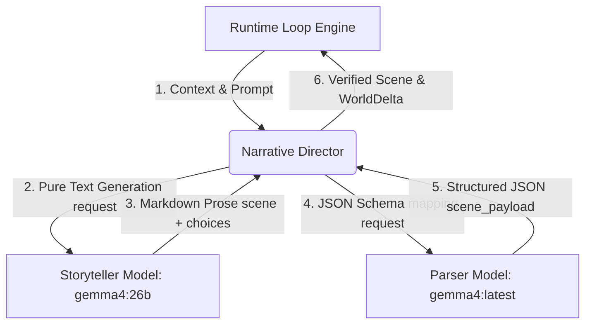

# Plan: Dual-Model Narrative Orchestration (이원화 서사 오케스트레이션)

최종 갱신: 2026-06-10
상태(2026-06-14): 구현·배선 완료(스토리 `OLLAMA_MODEL_STORY`=`gemma4:latest` 8B → 파서
`OLLAMA_MODEL_PARSER`=`qwen2.5:3b-instruct`). ⚠️ 본문은 26B/64GB 가정으로 작성됐으나, 실측 RAM
48GB 제약으로 스토리 모델을 26B→8B로 전환함(`docs/DECISIONS.md` 2026-06-11). 권위: `docs/STATUS.md`.

## 1. 개요 및 목적

*   **배경**: `gemma4:26b` 모델은 뛰어난 문학성/스토리텔링 품질을 가졌으나, 대용량 프롬프트 + 장문 한글 생성 + 엄격한 `json_schema` Grammar 제약이 한데 얽힐 때 한국어 토큰 예측 확률 분포가 붕괴(repeat collapse)하는 병목이 있었습니다.
*   **목표**: Gemma 26B의 스토리텔링 품질을 온전히 보존하면서 JSON 구문 붕괴를 원천 차단하고, M4 Max 64GB Mac Pro의 풍부한 메모리 자원을 활용해 안정적이고 빠른 내러티브 생성 파이프라인을 구축합니다.
*   **해법**: **스토리텔러(Gemma 26B, 자유 텍스트)**와 **구조화 파서(Gemma 8B/소형 모델, 정형 JSON)**로 역할을 분리하는 이원화(Dual-Model) 오케스트레이션을 구현합니다.

---

## 2. 이원화 파이프라인 설계

### 1단계: 26B 스토리텔러 (Storyteller)
*   **역할**: 어떤 JSON 문법 제약도 받지 않고, 18k 컨텍스트를 분석하여 풍부하고 소설적인 장면 서사(Narration)와 선택지 텍스트를 자유 텍스트 형식으로 생성합니다.
*   **포맷**: 파싱이 용이하도록 단순한 마크업 태그(예: `[SCENE]`, `[TITLE]`, `[LOCATION]`, `[CHOICES]`) 형식으로 유도합니다.

### 2단계: 8B 구조화 파서 (Parser)
*   **역할**: 1단계에서 생성된 비구조화 텍스트 장면을 입력으로 받아, 기계가 파싱할 수 있는 완벽한 [schemas.py](file:///Users/men1692/Desktop/local/MythOS/src/mythos_narrative/schemas.py) JSON 오브젝트 계약(`scene`, `world_delta`, `visual_brief` 등)으로 변환합니다.
*   **이점**: 이미 창작된 텍스트를 구조화만 하므로, 8B 모델이 Grammar 제약을 받더라도 2~3초 내에 오류 없이 신속하게 JSON을 생성합니다.

---

## 3. 구현 세부 계획

### Step 1: 환경 변수 확장
*   `.env` 및 [config.py](file:///Users/men1692/Desktop/local/MythOS/src/mythos_image_agent/config.py)에 스토리용 모델과 파서용 모델을 별도로 정의합니다.
    *   `OLLAMA_MODEL_STORY` (기본값: `gemma4:26b`)
    *   `OLLAMA_MODEL_PARSER` (기본값: `gemma4:latest` 또는 `gemma4:8b` 계열)
*   하위 호환성을 위해 `OLLAMA_MODEL` 변수가 지정되어 있고 스토리/파서 변수가 없을 때는 단일 모델 모드로 폴백 동작하도록 가드 처리합니다.

### Step 2: 26B 전용 스토리텔러 프롬프트 추가
*   [prompts.py](file:///Users/men1692/Desktop/local/MythOS/src/mythos_narrative/prompts.py)에 마크다운 포맷만을 강제하는 `STORY_SYSTEM_PROMPT`와 `build_story_messages`를 추가합니다.
*   기존의 복잡한 JSON contract 지시어를 모두 제거하고, 26B의 어휘 능력을 살리는 네거티브 프롬프트를 보강합니다.

### Step 3: 8B/14B 전용 구조화 파서 프롬프트 추가
*   [prompts.py](file:///Users/men1692/Desktop/local/MythOS/src/mythos_narrative/prompts.py)에 텍스트 장면을 JSON Schema로 가공하기 위한 `PARSER_SYSTEM_PROMPT`와 `build_parser_messages`를 설계합니다.

### Step 4: `NarrativeDirector` 단의 2단계 오케스트레이션 배선
*   [director.py](file:///Users/men1692/Desktop/local/MythOS/src/mythos_narrative/director.py)의 `_generate` 및 `_stream_generate` 흐름을 수정합니다.
*   1차로 `OLLAMA_MODEL_STORY`를 통해 텍스트 씬을 생성하고, 2차로 `OLLAMA_MODEL_PARSER`를 통해 JSON 구조화를 수행합니다.
*   최종 리턴 타입(`Scene`, `ScenePayload`)과 API 계역을 동일하게 유지하여, 런타임 및 UI 등의 하위 의존성을 완전히 차단합니다.

---

## 4. 검증 및 검사 기준

*   **기본 유효성**: `make test` 회귀 테스트 100% 통과.
*   **스모크 테스트**: `make narrative-smoke` 구동 시 2개 모델이 순차적으로 정상 호출되며 붕괴 없는 고품질 JSON 씬이 서빙되는가.
*   **성능 실측**: 총 Latency가 25초 이내로 제어되며, `narration` 및 `title` 필드에 반복 붕괴 현상이 사라졌는가.
