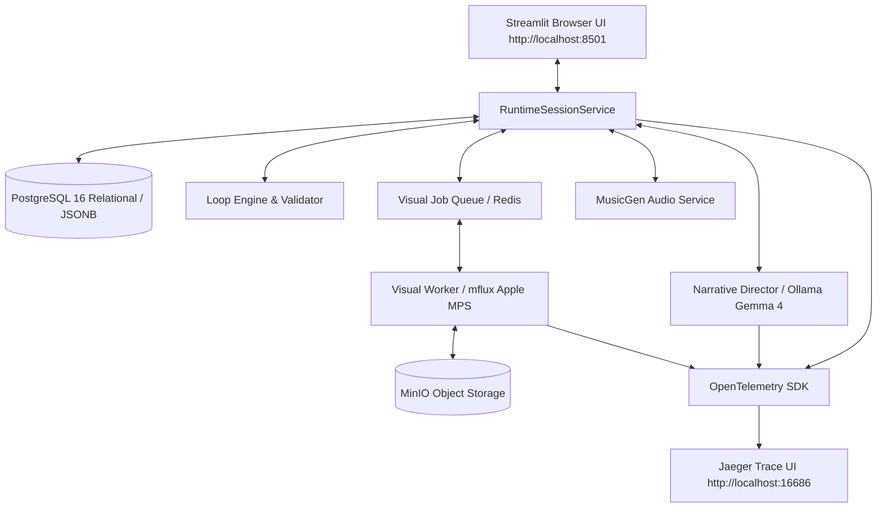

# Project MythOS (세계:접속) Project Overview

> **"신호가 끊어지기 전에, 붕괴하는 코드 속에서 신화를 재작성하라."**
> 
> Project MythOS는 AI가 게임마스터(GM) 역할을 수행하는 **1인용 SF 루프형 TRPG/CRPG**입니다. 플레이어는 세계의 의지를 감시하고 정정하려는 관리망에 맞서, 형태가 매 순간 뒤바뀌는 데이터 세계로 다이브하는 첫 번째 **'접속자(Connector)'**가 됩니다.

---

## 🌌 1. 세계관 & 코어 플레이 경험

### 1.1 "루프는 끝이 아닌 새로운 접속의 시작이다"
세션(루프) 단위 플레이를 통해 세계에 다이브하며, 플레이어의 모든 행동은 세계에 미세한 균열을 냅니다.
*   **신경망 안정도(Stability)와 긴장도(Tension)**: 세션 생존을 결정하는 실시간 임계값입니다. 안정도가 무너지거나 긴장도가 극에 달하면 세계는 **'붕괴(Blackout)'**하여 세션이 강제 종료되지만, 이는 게임 오버가 아닌 다음 세션을 위한 **인과율의 기록 단계**로 이어집니다.
*   **잔향(Echo)**: 이전 루프에서 플레이어가 내린 도덕적/서사적 결정들은 데이터의 찌꺼기인 '잔향'이 되어 다음 루프의 세계 속에 실체화(NPC의 대사 변형, 공간의 글리치 징후)되어 나타납니다.
*   **기억의 별자리 (Codex)**: 루프를 반복하며 파편화된 **단서(Narrative Shard)**들을 누적 수집합니다. 단서들이 임계치를 넘으면 세계의 숨겨진 비하인드 설정(Lore)과 새로운 접속 분기점이 영구 해금됩니다.

---

## 🎲 2. 하이브리드 게임플레이 시스템

### 2.1 AI Game Master (Ollama Gemma 4 백엔드)
정해진 트리형 분기가 아닌, 플레이어의 행동 선언(자유 텍스트 입력)을 AI GM이 분석하여 즉흥적(Improv)으로 반응하고 판정합니다. 소설/비주얼 노벨 작법 가이드라인을 주입하여 높은 문학적 몰입도를 선사합니다.

### 2.2 RPG 스탯 및 자율성 진행도 (Autonomy System)
플레이어는 생성 시점의 **소질(Archetype)**과 **5대 핵심 스탯**을 기반으로 세계와 조우합니다.

| 스탯 | 의미 | 주요 판정 활용 |
| --- | --- | --- |
| **근력 (Strength)** | 신체적 위력과 지구력 | 물리적 장애물 돌파, 직접적 충돌, 신체적 저항 |
| **연산 (Intelligence)** | 논리적 분석과 해킹 | 시스템 코드 해킹, 보안 우회, 미스터리 퍼즐 분석 |
| **공명 (Charisma)** | 사회적 영향력과 감성 | NPC 설득/협상, 에코(Echo)와의 교감, 여론 선동 |
| **반사 (Agility)** | 반응 속도와 정밀함 | 기습 회피, 은밀한 침투, 긴급 행동 선언 |
| **관측 (Perception)** | 숨겨진 데이터 감지 | 단서 Shard 포착 확률 증가, 글리치 이면의 진실 감지 |

> [!IMPORTANT]
> **심리적 가드레일 (Autonomy progression)**
> 플레이어의 자율성 레벨(Autonomy Level: LV 1~5)이 낮을 때는 관리망의 통제 코드나 데이터적 공포로 인해 과격하거나 반역적인 자유 입력을 선언해도 캐릭터가 주저하거나 실행에 실패하는 서사적 제약(가드레일)이 작동합니다. 단서 수집을 통해 레벨이 상승하면 가드레일이 점차 해금되어 세계에 직접적인 코드를 재작성하는 개입을 시도할 수 있습니다.

### 2.3 SRPG식 전술 전투 (Tactical Combat)
서사 진행 중 적과 조우하거나 작전 지도에서 적 시그널과 충돌하면 **엔진 권위 전술 전투 모드**로 즉시 전환됩니다.
*   **드래그 앤 드롭 캐릭터 직접 이동**: Streamlit UI의 샌드박스를 우회한 `st.components.v1.html` 독립 iframe 설계를 통해, 마우스로 캐릭터 포트레이트를 드래그해 이동 경로에 놓거나 직접 타일을 클릭하여 실시간으로 캐릭터를 이동시킵니다.
*   **드래그 오버 글로잉 연출**: 드래그가 시작되면 이동 가능한 모든 바닥 타일들이 **네온 시안 빛의 깜빡이는 맥박 글로잉 효과(`@keyframes neon-glow-pulse`)**를 뿜어내어 뛰어난 연출성과 조작감을 제공합니다.
*   **턴제 전투 메커니즘**: 공격 사거리 판정, Roster HP 게이지 상태, 적 AI 로직, 방어/도주 액션 및 정밀 전투 결과 정산 패널을 완벽하게 지원합니다.

---

## 🎨 3. Y2K 사이버-신화 아트 & 사운드 디렉션

### 3.1 Y2K / CRT 글리치 비주얼 파이프라인
*   **비주얼 컨셉**: 딥블루(#0a0f1a) 배경, 사이버 시안(#00ffe6) 네온, 골드 포인트 컬러를 메인으로 합니다.
*   **비동기 FLUX 이미지 생성**: AI GM이 실시간 생성한 `Scene.visual_brief` 키워드에 Y2K/CRT 스캔라인, 색수차, 노이즈, 글로우 필터를 결합하여 대표 이미지를 렌더링합니다.
*   **Apple Silicon MLX(mflux) 8bit 양자화 백엔드**: 프로세스당 1회 파이프라인 캐싱 및 8bit 양자화를 기본 적용하여 이미지당 생성 속도를 diffusers 대비 20배 향상(약 8초)시켰으며 비동기 Redis 큐 기반으로 구동됩니다.

### 3.2 로컬 음악 생성 및 동적 사운드트랙 (MusicGen)
*   **상황별 사운드 연출**: Calm(메인/탐색), Tense(긴장), Unstable(위협/전투) 상황 전환 시 배경 음악(BGM)이 끊김 없이 실시간으로 동적 크로스페이드(Crossfade)되어 재생됩니다.
*   **Wake Interaction**: 브라우저 오디오 보안 정책을 우회하여 BGM의 영구 재생을 보장하는 디제틱 부팅 단계를 구현했습니다.

---

## 🏗️ 4. 기술 아키텍처 및 로컬 개발 스택



*   **Runtime Core**: Python 3.11+, Streamlit(UI)
*   **Language Model**: Ollama local (default model: `gemma4:latest`)
*   **Database**: PostgreSQL 16 (Relational schemas & JSONB Loop state)
*   **Object Storage**: MinIO (S3-compatible local media storage)
*   **Task Queue**: Redis (Visual job queue / workers)
*   **Observability**: OpenTelemetry SDK + Jaeger (OTLP HTTP tracing)

---

## 🚀 5. 실행 및 확인 가이드

### 5.1 인프라 셋업 & 마이그레이션
```bash
# 1. 환경 변수 구성 및 가상환경 셋업
cp .env.example .env
make setup

# 2. 로컬 도커 인프라 가동 (Postgres, MinIO, Redis, Jaeger)
make infra-up

# 3. DB 마이그레이션 실행
make db-migrate
```

### 5.2 런타임 자가진단 (Smoke Test)
```bash
# 로컬 스택 및 컴파일, 유닛테스트, 폴백 시나리오, DB 연동 무결성 테스트
make smoke-local
```

### 5.3 브라우저 데모 실행
```bash
# Streamlit 데모 가동
make streamlit
```
*   가동 후 브라우저에서 `http://localhost:8501`에 접속하여 플레이어 뷰와 개발자 뷰를 오가며 사이버-신화 세계관의 튜토리얼 루프를 즐길 수 있습니다.
